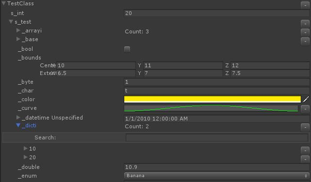

# unity_data_inspector
Inspect/Edit any data from Editor script through reflection, supports tolua. Highly extensible. 



# 如何使用

功能由下面两个文件夹的.cs 代码实现，拷贝到自己的工程即可。

文件夹 | 功能
-|-
Inspector  | 主功能，支持C# 和 Unity 对象
Inspector_tolua_extension | [tolua](https://github.com/topameng/tolua) 插件，支持tolua1.0，目前只支持 LuaTable

# Examples

对于每个范例，需要首先执行 mklink.cmd，他会引用 Inspector / Inspector_tolua_extension 代码。

文件夹 | 范例
-|-
Example0_BasicUse | 基本的功能展示
Example1_CustomType | 自定义普通数据类型、以及一个自定义的字典容器的数据查看。特别的，容器应当继承CollectionVisualizerBase，以便支持搜索，以及超大容器的成员折叠。
Example2_tolua | tolua 支持，目前只支持 LuaTable

# 特性

## 自定义展示器

查看器根据数据类型找到注册的Visualizer展示内容。查看器已经预注册了一批的展示器，可以良好地处理Unity和C#内容。用户可以添加新的展示器，还可以修改或者移除所有预注册的展示器。

> 注意: 你需要在调用 Inspect() 之前执行所有定制注册。 查看器内部有一个类型缓存，不会及时刷新。

```c#
class MyVisualizer : VisualizerBase { /**/ }

ins.RemoveAllVisualizers()

ins.GetVisualizer(Type type)
ins.SetVisualizer(Type type, VisualizerBase income)
ins.RemoveVisualizer(Type type)

ins.GetSpecialVisualizer(SpecialVisualizer type)
ins.SetSpecialVisualizer(SpecialVisualizer type, VisualizerBase income)
```

当用户需要精确控制匹配时，可以自定义Attribute。 例如，整数一般使用整数查看器，但是某个整数为unix时间戳，我们希望查看时能显示时间；又或者希望标记某个string 为本地化文本，于是就可以在展示器中将 "skill.101.name" 翻译成 "Rocket Punch" 或者 "火箭飞弹" 。 这个时候，你可以字段上添加 Attribute，然后定义Attribute对应的查看器。

```c#
[UnixTimestamp]int time;
[Locale]string skill_name;
```

### 展示器的匹配顺序

当遇到一个类型时，系统按如下的顺序找到匹配的查看器 Visualizer：

* 字段上有派生自 IMark Attribute
* null -> SpecialVisualizer.PrimitiveAndNull
* enum -> SpecialVisualizer.Enum
* 注册的 type 是一个精确匹配
* 注册的 type 是数据的首个精确匹配的基类 (例如：IList<int>) 或者首个匹配的泛型基类 (例如: IList<>)
	* 在同一个基类上，精确匹配比泛型匹配优先
* 注册的 interface 匹配
  * 如果多个 interface 匹配的话，匹配结果是未明确指定的。 从当前实现来说，会匹配到GetInterfaces()结果中的首个匹配条目
* 使用 SpecialVisualizer.Composite，这个查看器一般会显示所有成员变量。
